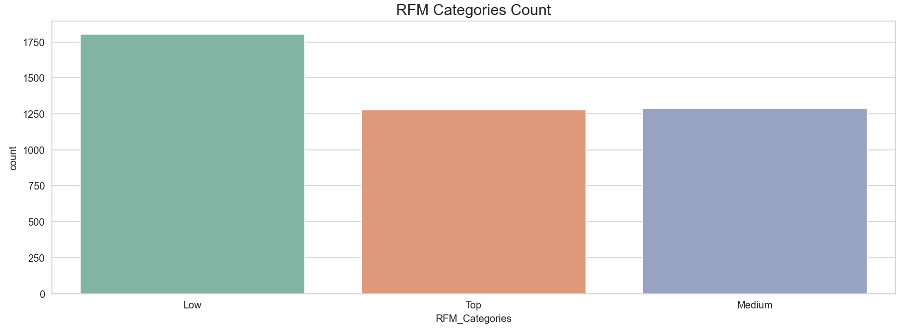
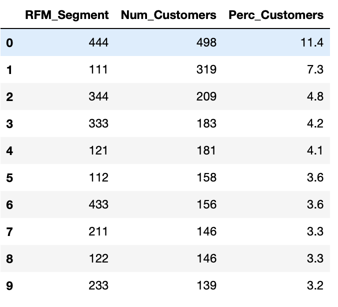
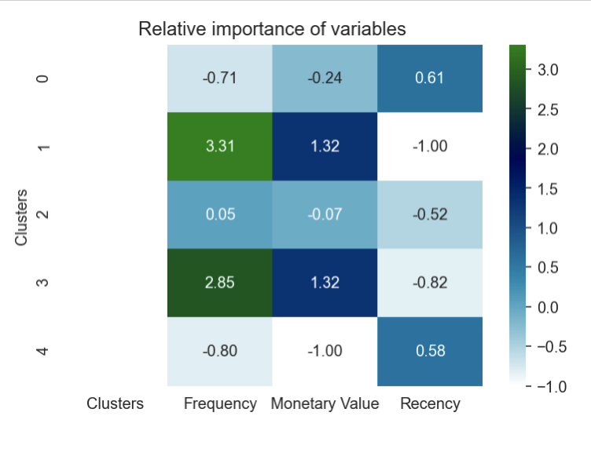

# RFM Analysis

## AIM
To perform Recency, Frequency, Monetary Value (RFM) Analysis on  Online Retail II Dataset and group customers in distinct clusters using K-Means algorithm. 

## Dataset
The dataset is called Online Retail II and is a part of UCI machine learning repository and can be downloaded by following this [link](http://archive.ics.uci.edu/ml/datasets/Online+Retail+II). The  data set contains all the transactions occurring for a UK-based and registered, non-store online retail between 01/12/2009 and 09/12/2011.The company mainly sells unique all-occasion gift-ware. For the analysis purpose, however, I have considered transactions between the years 2010-11.

## Libraries Used

The analysis is carried out using Python 3.9 . Following are the libraries used:
    
- Data Analysis : Pandas 1.2.3
- Visualization: Matplotlib 3.3.4, Seaborn 0.11.1
- Clustering: Scikit-learn 0.24 (K-Means)
- Scaling: Scikit-learn 0.24 (Standard Scaler)

## Analysis Highlights

- Eliminated duplicate transactions & null values.
- Identified irrelevant transactions such as POSTAGE, CARRIER, COMMISSION related to the company and not the customers and eliminated them.
- Computed RFM Segments, RFM Scores and RFM Categories.
- Fixed the right skewed data by applying log transformation.
- Fixed negative and 0 values before log transformations.
- Scaled the values to standardize the mean and variance.
- Used K-Means to form 5 distinct clusters of customers based on the RFM scores.

## Results

- Further details about the RFM analysis can be found in [RFM_Analysis.ipynb](RFM_Analysis.ipynb).

- Further details about K-Means Clustering can be found in [RFM_Segmentation_Kmeans.ipynb](RFM_Segmentation_Kmeans.ipynb.ipynb)

## RFM Results

- From the RFM Analysis it can be observed that a lot of customers in dataset have RFM score of below 6 out of 12. This means these customers require attention, while top customers and customers with medium scores are in same proportion. 

- 444 is the largest customer segment at 11.4% which also turns out to be the best group. In addition, at second place is the 111 segment with 7.3% which as it turns out is also the worst customer base for online retail. 344 & 333 are also not bad customer segments at 3rd and 4th place.

## K-Means Clustering

According to the elbow plot optimal number of clusters was 5. Analysis of 5 clusters:

- Cluster 0: Recency is the most important for this group
- Cluster 1: Frequency is the most important in this group as compared to any other groups, followed by Monetary Value.
- Cluster 2: Frequency is the only metric important in this group.
- Cluster 3: Similar to cluster 1 Frequency and Monetary Value is important for customers in this group.
- Cluster 4: Recency is the most important for this group.

